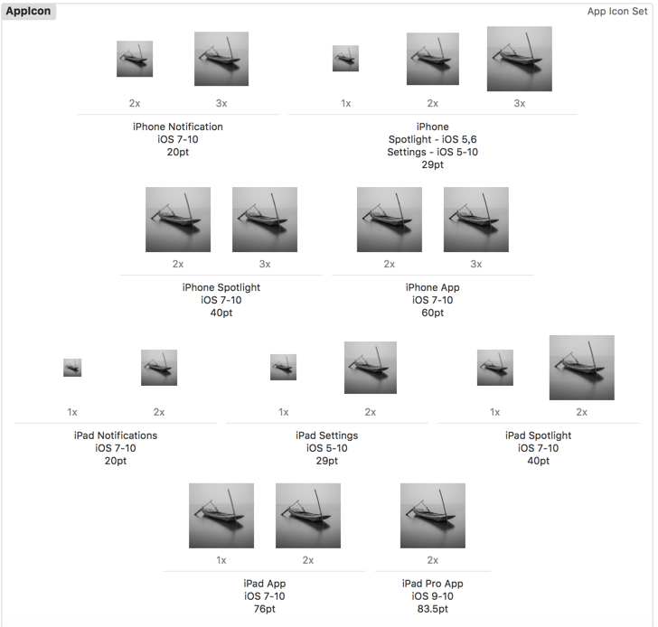
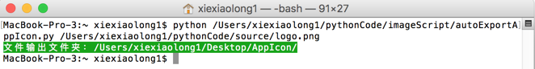
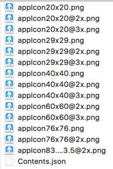
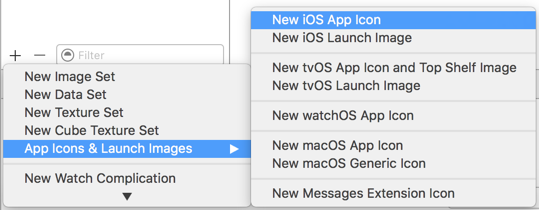
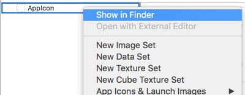

# autoExportAppIcon

#### One key to generate iOS app icon   
   

### Useage
`python /path/autoExportAppIcon.py /path/image.jpg`   
   

   
New iOS App Icon   
   
show in finder   
   

   
replace the files.   